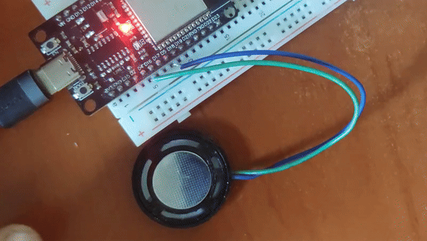

# TouchLed Arduino ESP32 Library



The **TouchLed** library lets you hook up an LED to your ESP32 and have it double as a touch button.
More precisely, the connect the positive lead of the LED to some exposed wire, a piece of metal, whatever, and touching it will act as pushing a button. With LED automatically following depending on the role, pushbutton, toggle (press-on press-off), or whatever you want it to do.

Note: Touch inputs are specific to ESP32, not other Arduinos, and not even all ESP32 support them (Sorry, S3 SuperMini users!) - and in specific dev boards different Touch pins may be hooked up to other functions and always read zero (on ESP32 Devkit v1, T1 and T2 are unusable).


## Table of Contents
1. [Features](#features)
2. [Misfeatures](#misfeatures)
3. [Installation](#installation)
4. [Calibration](#calibration)
5. [Examples](#examples)
6. [3D Printable Button Project](#3d-printable-button-project)
7. [Public API Reference](#public-api-reference)
    - [Constructor](#constructor)
    - [Methods](#methods)
    - [LED Behaviors](#led-behaviors)
    - [Callbacks](#callbacks)
    - [Other Properties](#other-properties)
8. [Private API Reference](#private-api-reference)
9. [Troubleshooting](#troubleshooting)
10. [License](#license)

## Features

- **Capacitive Touch Input**: for annoying people with wet hands.
- **LED Control**: 3 automatic and 1 manual mode.
- **Long Press Detection**: Touch, Toggle AND LongPress?!
- **Header-only**: Really small, really simple.
- **Runs on FreeRTOS background thread**: no upkeep in loop()! Did you know you got FreeRTOS for free when adding the ESP32 board to Arduino? 
- **Project for 3D printable button**: Easy and pretty.

## Misfeatures
- **Configurable Touch Thresholds**: Not so much feature as annoyance, but hey, these things must be calibrated.
- **Blinking** - Incessant blinking when LED active. Touch readout is forcing the LED off for a fraction of second, at configurable rate.
- **3-Wire Operation**: Workaround for the blinking, with all the magic of the LED being touch-sensitive gone.
 
The schematic couldn't be any easier. Not even a resistor for 2-wire operation. And getting something *working* as a touch pad is beyond easy, anything metal, metallized, conductive, or even wet works. Finding a *pretty* one is the challenge!


"Touch" is any GPIO labelled on the pinout as Touch[num]. "Sink" is any GPIO, can be touch, can be non-touch. Must be able to write, not just read.

Why Touch and Sink, and not Touch and GND? Because connecting Touch to GND immediately puts it into 'pressed' state. The Sink is put into High Impedance mode during touch readout, and LOW state while LED is lit (making it act as Ground + some resistance)

Can it be made not to blink and still work with two wires? Probably, but it would require rewriting the builtin `touchRead()` to be non-blocking and perform the reads very, very fast (and aggregate them later to remove noise). Quite a bit above my current skill level.


## Installation

To install the TouchLed library:

 - Find TouchLed in the Arduino library manager and add it to Arduino IDE *(pending)*, 
 
or

 - download [TouchLed.h](https://github.com/bwucke/TouchLed/blob/main/src/TouchLed.h) and put it into your sketch directory next to the .ino file
 

## Calibration

Once you have the hardware in place, before you start writing code, you need to know what values the touch input reads to set thresholds between 'pressed' and 'not pressed'.

Run this as a new sketch before using TouchLed with a new button, new board etc. (copy-paste or grab from examples/Callibration)

Write down the value it shows on serial terminal when not touching the button, and when touching it.
Pick the threshold values roughly halfway between these two values, 'on threshold' about 5-10 lower than 'off threshold', and pass them as 3rd (on, lower) and 4th (off, higher) parameter of the constructor. 

```cpp
const int touchPin = 4;
const int sinkPin = 5;

void setup() {
  Serial.begin(115200);
  pinMode(sinkPin, INPUT);
}

void loop()
{
  Serial.println(touchRead(touchPin));
  delay(100);
}
```

## Examples

The most basic, typical usage will look something like this:

```cpp
#include <TouchLed.h>

TouchButton button(T0, 13, 30, 35);  // Touch pin T0, LED on pin 13.

void setup() {
  Serial.begin(115200);
  button.begin();
  button.pressedCallback = onPressed;
}

void loop() {
	// no need to do anything here
}

void onPressed() {
  // do something interesting here
  Serial.println("Button pressed!");
}

```

For more detailed examples, refer to the `TouchLed/examples/` folder or examples attached when you install through Arduino Library Manager.


Topics covered:
 - direct reading, continuous and on edge
 - callbacks
 - 3-wire mode
 - manual control of the LED
 - running without FreeRTOS thread
 - an everything and a kitchensink demo

### 3D Printable button project
3D printable STLs alongside with instruction how to build a button can be found in [extras](/extras) and on [Thingiverse](https://www.thingiverse.com/thing:6772678).


## Public API Reference

### Constructor

```cpp
TouchButton(int touchPin, 
            int sinkPin, 
            int thresholdOn = 30, 
            int thresholdOff = 35, 
            int periodMs = 100, 
            int longPressMs = 3000);
```

- `touchPin`: The pin connected to the touchpad.
- `sinkPin`: The pin controlling the LED.
- `thresholdOn`: Threshold for detecting a press.
- `thresholdOff`: Threshold for detecting a release.
- `periodMs`: The update period in milliseconds.
- `longPressMs`: The time (in milliseconds) to trigger a long press.

### Methods

- `void begin()`: Starts the FreeRTOS touch detection task.
- `void end()`: Stops the FreeRTOS touch detection task.
- `bool Pressed()`: Returns whether the button is currently pressed.
- `bool Toggled()`: Returns true after every even press, false after every odd.
- `bool LongPressed()`: Returns whether a long press has occurred.
- `void SetLedBehavior(LedBehavior behavior)`: See Led Behaviors below.
- `void SetLedState(bool state)`: Manually sets the LED state (only valid for `MANUAL` mode).

### LED behaviors

The library supports different **LED behaviors**, which can be configured using the `SetLedBehavior(TouchLed::BEHAVIOR)` method:
- `PUSH`: LED lights up while the button is pressed.
- `PUSH_INVERTED`: LED is off while pressed.
- `TOGGLE`: LED toggles between on/off states on each press.
- `MANUAL`: Full manual control of the LED state through `SetLedState()`. Handy when you want custom logic. 

### Callbacks

- `void (*pressedCallback)()`: Set this to a function to handle the button press event.
- `void (*releasedCallback)()`: Set this to a function to handle the button release event.
- `void (*toggledCallback)(bool on)`: Set this to handle toggling.
- `void (*longpressCallback)()`: Set this to handle a long press event.

### Other Properties

-  `int touchPin`: Positive terminal GPIO#
-  `int sinkPin`: Negative terminal GPIO#
-  `int periodMs`: How often the touch reads the button (and annoyingly blinks the LED)
-  `int thresholdOn`: What readout counts as 'button pressed'
-  `int thresholdOff`: What readout counts as 'button released'
-  `unsigned long longPressMs`: How long to hold the button to count as Longpress ()
-  `unsigned long lastPressTime`: the millis() readout from the last press.
-  `bool pressed`: literally that.
-  `bool toggleIsOn`: Flips every other press. LED in TOGGLE mode follows that.
-  `bool longpressed`: literally that.
-  `bool longpresSent`: true after the longpress callback triggered but still pressed
-  `touch_value_t touchValue`: last raw readout
-  `TaskHandle_t taskHandle`: ...if you want to do stuff with the RTOS task.
-  `LedBehavior ledBehavior`: the enum holding currently set behavior.
-  `bool LedSetState`: What's been set by `SetLedState()`
-  `bool reversePolarity`: AKA "I soldered the LED backwards". Set, and Sink starts providing +, Touch becomes -. Touch area still needs to be on the 'touch' pin side. LED is a diode after all, and filters the touch signal away quite well, sensitivity goes down the gutter.
-  `bool threeWire;` set to true for 3-wire operation, Touch only goes to touch pad, Led is between Sink and Gnd. Led ceases blinking, With reversePolarity, sink is active low.  
  
## Private API Reference

None. It's all public. Literally anything can be changed on the fly and will work OK and changing it may be useful in some very obscure scenarios, so after thorough consideration I found my `private:` part of the class empty. Changing the pins assigned to Touch and Sink on the fly will leave the old pins in uncertain state but otherwise, want to switch callback? Want to switch polarity? feel free.

## Troubleshooting
 
#### I'm running the calibration sketch and The sensitivity is very poor, the read value barely changes!

First, check if you hooked it to the right pin. Run your fingers over the pins of your dev board, does one of them change more as you do? Next, is your touchpad hooked on the Touch input side of the LED? The Light-emitting *diode* is a pretty good filter for this sort of signal. Also, use this to find pins that work. 

```

void setup() {
  Serial.begin(115200);
  pinMode(sinkPin, INPUT);  // high impedance
}

int pins[] = {T0, T1, T2, T3, T4, T5, T6, T7, T8, T9};

void loop()
{
  for(int i=0; i<10; ++i)
  {
  Serial.printf("T%d = %d   ", i, touchRead(pins[i]));
  }
  Serial.println("");
  delay(100);
}
```

#### `void value not ignored as it ought to be`

Make sure to assign your callbacks as `button.pressedCallback = onPressed;`, not   `button.pressedCallback = onPressed();`. You're assigning a function pointer, not the function call's return value. 

#### `'touchRead' was not declared in this scope`

Your ESP32 variant doesn't support touch inputs, likely. Or if it does, you've picked a wrong variant in board manager. Boards with touch support: ESP32 (Original), S2, S3, P4. No touch: ESP32-C2, C3, C5, C6, H2. 
Also note the "ESP32 S3 SuperMini" board sports ESP32-C3, and the "S3" in the board name is some kind of shenanigans.

## License

This library is released under the [Creative Commons Attribution License](https://creativecommons.org/licenses/by/4.0/). You are free to use, modify, and distribute the library, provided that you give appropriate credit.

